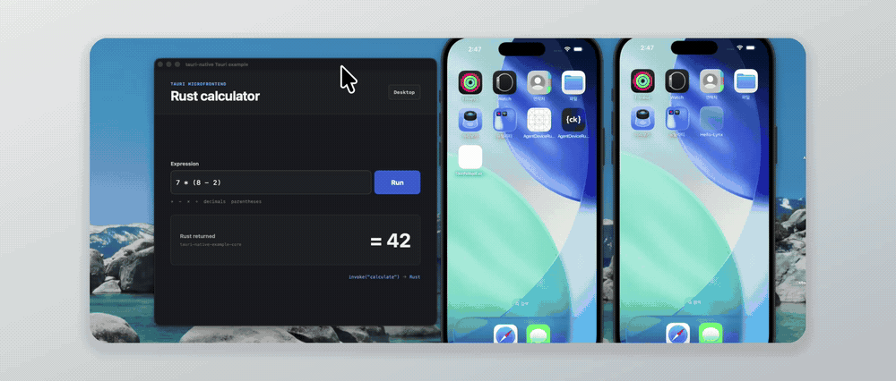
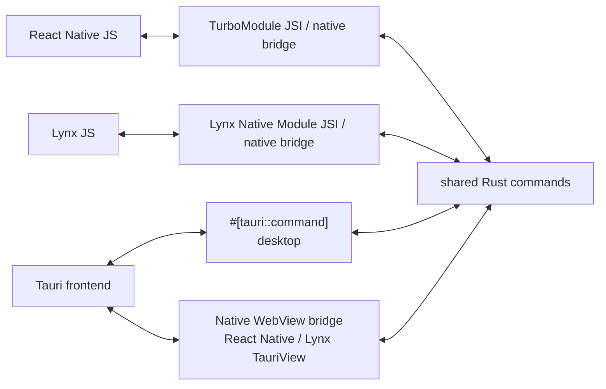

# tauri-native



> [!WARNING]
> This is a proof-of-concept (PoC) project currently under development.

Embed a packaged Tauri microfrontend in a React Native or Lynx application on iOS or Android, and call the same Rust command implementation from each host.

```tsx
import { TauriView, invoke } from '@tauri-native/react-native';

const response = invoke<Calculation>('calculate', {
  expression: '7 * (8 - 2)',
});

export function Screen() {
  return <TauriView style={{ height: 330 }} />;
}
```

## Why tauri-native?

`tauri-native` is for teams that have ordinary, independently runnable projects:

- a React Native or Lynx application that owns the mobile lifecycle and native navigation;
- a Tauri application that owns a web frontend and reusable Rust behavior.

Adding `tauri-native` packages the Tauri frontend and Rust core for the mobile host without merging scaffolds or starting a second Tauri application runtime.

The examples preserve that boundary on purpose: `examples/react-native`, `examples/lynx`, and `examples/tauri` remain ordinary scaffolded applications. The mobile screens show a native direct-call area and a visibly separate `TauriView` surface; the same Tauri project also runs as the desktop application. The React Native host uses Expo SDK 57 Continuous Native Generation, so its iOS and Android projects are regenerated from `app.json` and the `@tauri-native/react-native` config plugin instead of being maintained by hand.

On desktop, that Tauri frontend fills the native window. On mobile, the same packaged frontend appears only inside the labeled `TauriView` boundary, so ownership remains visible in the demo rather than being hidden by matching chrome.

## Packages

| Package | Responsibility |
| --- | --- |
| `@tauri-native/react-native` | Fabric `TauriView`, synchronous TurboModule `invoke`, and iOS/Android native integration |
| `@tauri-native/lynx` | Lynx custom `TauriView`, typed native-module `invoke`, and iOS/Android native integration |
| `@tauri-native/cli` | Exports the Rust core and Tauri frontend for iOS and Android native hosts |

`@tauri-native/react-native` uses React Native Builder Bob to produce ESM and TypeScript declarations. `@tauri-native/lynx` follows Lynx Native Library autolinking and code generation. `@tauri-native/cli` uses Commander for its command interface and `@clack/core` for terminal output.

The packages are configured to publish under the `experimental` npm dist-tag. Install the CLI in the Tauri project that owns the frontend and Rust code. Install only the matching bridge package in each native host.

```sh
# Run in the Tauri project
npm install --save-dev @tauri-native/cli@experimental

# Run in the React Native or Lynx host
npm install @tauri-native/react-native@experimental
# or: npm install @tauri-native/lynx@experimental
```

## Bring an existing Tauri project

Keep the Tauri application and the mobile host as independent projects. Install `@tauri-native/cli` in the **Tauri project**. The package exposes the `tauri-native` executable and exports native artifacts from that project to any host that needs them.

For example, given sibling projects:

```text
workspace/
├── mobile-app/
└── tauri-app/
    └── src-tauri/
```

install and run the CLI from the Tauri project:

```sh
cd workspace/tauri-app
npm install --save-dev @tauri-native/cli@experimental
npx tauri-native export ios
npx tauri-native export android
```

The default iOS export is written to `src-tauri/gen/tauri-native/ios`. It contains the XCFramework, packaged frontend, local podspec, command metadata and integrity manifest. Copy the complete directory to the host; source access is not needed afterward. See the [portable artifact contract](docs/artifacts.md). The Android equivalent is written to `src-tauri/gen/tauri-native/android`. The CLI can also export straight into a chosen host:

```sh
npx tauri-native export ios \
  --output-dir ../mobile-app/ios/tauri-native
```

The default source implementation reads the ordinary `src-tauri/Cargo.toml` and registered commands, then owns adapter, native crate-type and header generation in a disposable copy. No app-core extraction or producer SDK is required. Run `tauri-native inspect` to see the verified commands and source diagnostics. The earlier published 0.1.0 release and current calculator example use the explicit legacy `--manifest` route. See the [CLI guide](packages/cli/README.md) and [bounded compatibility contract](docs/compatibility.md).

For Expo, configure `@tauri-native/react-native` with the relative `tauriDir`. During `expo prebuild`, the plugin copies the existing co-located export into the generated iOS or Android project; it does not build the Tauri project. For Lynx or bare React Native, reference or copy the platform export explicitly.

## Architecture



## Run the example workspace

Install dependencies and generate the mobile projects and artifacts:

```sh
nub install
nub --cwd examples/tauri run export:ios
nub --cwd examples/tauri run export:android
nub --cwd examples/react-native run prebuild:clean:ios
nub --cwd examples/react-native run prebuild:clean:android
nub --cwd examples/lynx run pods
nub --cwd examples/lynx run build:android
```

The Tauri example owns the co-located exports under `src-tauri/gen/tauri-native`. Expo prebuild copies the selected platform into its generated application, while the Lynx Podfile references the iOS export directly. Re-run the matching export after changing the embedded Tauri frontend or Rust core.

Run the React Native example:

```sh
# Terminal 1
nub --cwd examples/react-native run start

# Terminal 2
nub --cwd examples/react-native run ios
```

Use `nub --cwd examples/react-native run android` instead for the Android host.

Build and open the Lynx iOS example:

```sh
nub --cwd examples/lynx run pods
open examples/lynx/ios/Hello-Lynx.xcworkspace
```

Build or install the Lynx Android example:

```sh
nub --cwd examples/lynx run build:android
nub --cwd examples/lynx run android
```

Run the same Tauri project as a normal desktop application:

```sh
nub --cwd examples/tauri run tauri dev
```

The example is a calculator rather than a hard-coded native response. JavaScript sends an editable expression to Rust. Rust parses decimals, unary signs, parentheses, and `+`, `-`, `*`, `/` with normal operator precedence.

The React Native screen exercises both mobile transports:

- `Run expression` calls Rust directly from React Native JavaScript through the generated TurboModule and native bridge.
- The embedded `TauriView` runs the packaged Tauri frontend, whose existing `@tauri-apps/api/core.invoke('calculate', ...)` call reaches the same Rust implementation.

The Lynx example presents the same two operations using its generated `TauriNative` native module and registered `tauri-view` custom element.

The Lynx frontend follows the create-rspeedy scaffold. Its native hosts follow Lynx's existing-app integration flow: initialize `LynxEnv`, provide the packaged bundle through a template provider, construct `LynxView`, and load `main.lynx.bundle`. [Native Library autolinking](https://lynxjs.org/guide/autolink) registers the tauri-native module and element through CocoaPods on iOS and Gradle on Android. `XElement` is included because the calculator uses Lynx's native [`<input>`](https://lynxjs.org/next/api/elements/built-in/input.html).

## React Native API

### `TauriView`

```tsx
import { TauriView } from '@tauri-native/react-native';

<TauriView style={{ flex: 1 }} />;
```

`TauriView` accepts standard React Native `ViewProps`. In this PoC it loads the single packaged frontend exported as an iOS resource bundle or Android asset directory. Selecting bundles or remote URLs is intentionally unsupported.

The native views disable WebView zoom, and the bundled demo locks viewport scaling so input focus cannot leave the embedded surface enlarged or horizontally clipped.

### `invoke<T>(command, payload)`

```ts
import {
  invoke,
  type InvokeResponse,
} from '@tauri-native/react-native';

interface Calculation {
  result: number;
  source: string;
}

const response: InvokeResponse<Calculation> = invoke('calculate', {
  expression: '(9 + 5) * 3',
});

if (response.ok) {
  console.log(response.value.result); // 42
} else {
  console.error(response.error.code, response.error.message);
}
```

The direct TurboModule API is synchronous. Keep commands short and CPU-bounded. File, network, database, or otherwise blocking commands require a future asynchronous API.

## Lynx API

```tsx
import { TauriView, invoke } from '@tauri-native/lynx';

const response = invoke<Calculation>('calculate', {
  expression: '(9 + 5) * 3',
});

export function Screen() {
  return <TauriView className="tauriView" />;
}
```

`invoke` uses the autolink-generated `TauriNative` native module. On both iOS and Android, the Lynx 4.0.1 runtime exposes that module through its JSI `NativeModules` binding and creates JSI host functions for its methods; the platform module then calls the shared Rust C ABI through Objective-C++ on iOS or JNI on Android. The package relies only on Lynx's public Native Module API, not its private JSI classes. Native module calls must run in Lynx background scripting (`'background only'`) and remain synchronous in this PoC. `TauriView` creates the registered native `tauri-view` element and loads the same packaged assets as the React Native component on iOS and Android.

## CLI

The [source-transparent export roadmap](plans/README.md) is underway. Its [versioned compatibility contract](docs/compatibility.md) records the exact native proof, source-integrity budget and unsupported cases. The source CLI now defaults to ordinary project discovery and generated adaptation; the previously published 0.1.0 release used the legacy core/header route.

```text
tauri-native inspect [--tauri-dir <path>] [--json]
tauri-native export ios [options]
tauri-native export android [options]

--tauri-dir <path>   Tauri Rust directory              default: src-tauri
--manifest <path>    Optional legacy application-owned core Cargo.toml
--header <path>      Optional legacy C ABI header (iOS only)
--output-dir <path>  Generated platform artifact directory
```

Workspace example:

```sh
nub --cwd examples/tauri run export:ios
nub --cwd examples/tauri run export:android
```

Equivalent direct invocation:

```sh
cd examples/tauri
npx tauri-native export ios --manifest src-tauri/crates/app-core/Cargo.toml
# or: npx tauri-native export android --manifest src-tauri/crates/app-core/Cargo.toml
```

To place a copy directly in a manually managed native host instead, pass `--output-dir ../react-native/ios/tauri-native` or another destination relative to the Tauri project.

The command reads `build.beforeBuildCommand` and `build.frontendDist` from `tauri.conf.json`, builds the frontend, and produces:

| Artifact | Contents |
| --- | --- |
| `TauriNativeCore.xcframework` | arm64 iOS device plus arm64/x86_64 simulator static libraries and C header |
| `TauriNativeAssets.bundle` | The unchanged files from the configured Tauri `frontendDist` |
| `TauriNativeGenerated.podspec` | A local Pod that exposes those application-specific artifacts to either native host package |

The generated output belongs to the Tauri project and is intentionally excluded from the npm packages. It can be copied into a native host or referenced as a local Pod. The Expo config plugin copies the co-located export during prebuild; the Lynx example references it directly.

Android export uses `cargo-ndk` at API level 24. It produces normalized Rust libraries for `arm64-v8a`, `armeabi-v7a`, `x86`, and `x86_64` under `gen/tauri-native/android/jniLibs`, plus the unchanged frontend under `gen/tauri-native/android/assets/tauri-native`. The CLI configures the required crate types in its generated copy.

The CLI generates native crate types and this versioned C ABI; producers do not author the header:

```c
uint32_t tauri_native_abi_version(void);
char *tauri_native_invoke(const char *command, const char *payload_json);
void tauri_native_string_free(char *value);
```

The returned UTF-8 JSON allocation belongs to Rust and must be released exactly once with `tauri_native_string_free`.

## License

MIT. See [LICENSE](./LICENSE).
