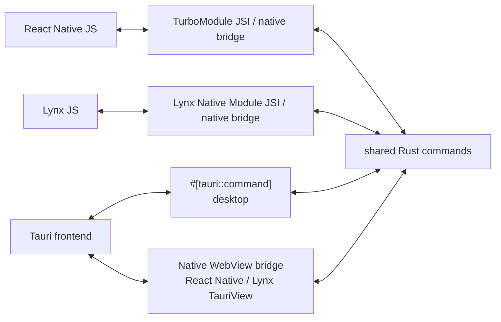

# tauri-native

> [!WARNING]
> Experimental release candidate: support is limited to the documented compatibility matrix. Independent onboarding and physical-device release checks remain open.

Embed a packaged Tauri microfrontend in a React Native or Lynx application on iOS or Android, and call the same Rust command implementation from each host.

```tsx
import { appDataDir, TauriView, invoke } from '@tauri-native/react-native';
import { createCommands } from './tauri-native/commands';

const command = createCommands(invoke);
async function searchNotes(query: string) {
  return command('search_documents', { directory: await appDataDir(), query });
}

export function Screen() {
  return <TauriView style={{ height: 330 }} />;
}
```

## Why tauri-native?

`tauri-native` is for teams that have ordinary, independently runnable projects:

- a React Native or Lynx application that owns the mobile lifecycle and native navigation;
- a Tauri application that owns a web frontend and reusable Rust behavior.

Adding `tauri-native` packages the Tauri frontend and Rust core for the mobile host without merging scaffolds or starting a second Tauri application runtime.

The canonical [Fieldnotes example](docs/examples/fieldnotes.md) saves and searches local documents using ordinary Rust and Tauri APIs. React Native/Expo and Lynx provide native quick capture and navigation to the same exported notebook frontend. The Tauri application remains independently runnable on desktop. The host owns its native project and persistent application data.

## Packages

| Package | Responsibility |
| --- | --- |
| `@tauri-native/react-native` | Fabric `TauriView`, nonblocking TurboModule `invoke`, and iOS/Android native integration |
| `@tauri-native/lynx` | Lynx custom `TauriView`, typed native-module `invoke`, and iOS/Android native integration |
| `@tauri-native/cli` | Exports the Rust core and Tauri frontend for iOS and Android native hosts |

`@tauri-native/react-native` uses React Native Builder Bob to produce ESM and TypeScript declarations. `@tauri-native/lynx` follows Lynx Native Library autolinking and code generation. `@tauri-native/cli` uses Commander for its command interface and `@clack/core` for terminal output.

The packages are configured to publish under the `experimental` npm dist-tag. Install the CLI in the Tauri project that owns the frontend and Rust code. Install only the matching bridge package in each native host. The earlier 0.1.0 packages predate the source-export APIs shown here; use matching candidate tarballs from this checkout to try Fieldnotes, following the [candidate walkthrough](docs/examples/fieldnotes.md). This checkout prepares 1.0.0-rc.0. The npm commands below select whichever experimental release is published; a version in the checkout does not establish registry availability. See the [migration guide](docs/migration.md) and [adoption gates](docs/adoption.md).

```sh
# Run in the Tauri project
npm install --save-dev @tauri-native/cli@experimental

# Run in the React Native or Lynx host
npm install @tauri-native/react-native@experimental
# or: npm install @tauri-native/lynx@experimental
```

## Bring an existing Tauri project

Keep the Tauri application and the mobile host as independent projects. Install `@tauri-native/cli` in the **Tauri project**. The package exposes the `tauri-native` executable and exports native artifacts from that project to any host that needs them.

For example, given sibling projects:

```text
workspace/
├── mobile-app/
└── tauri-app/
    └── src-tauri/
```

install and run the CLI from the Tauri project:

```sh
cd workspace/tauri-app
# Candidate built from this checkout; see the walkthrough above.
npm install --save-dev /path/to/tauri-native-cli-1.0.0-rc.0.tgz
npx tauri-native export ios
npx tauri-native export android
```

The default iOS export is written to `src-tauri/gen/tauri-native/ios`. It contains the XCFramework, packaged frontend, local podspec, command metadata and integrity manifest. Copy the complete directory to the host; source access is not needed afterward. See the [portable artifact contract](docs/artifacts.md). The Android equivalent is written to `src-tauri/gen/tauri-native/android`. The CLI can also export straight into a chosen host:

```sh
npx tauri-native export ios \
  --output-dir ../mobile-app/ios/tauri-native
```

The default source implementation reads the ordinary `src-tauri/Cargo.toml` and registered commands, then owns adapter, native crate-type and header generation in a disposable copy. No app-core extraction or producer SDK is required. Run `tauri-native inspect` to see the verified commands and source diagnostics. The earlier published 0.1.0 release and legacy calculator fixture use the explicit legacy `--manifest` route. See the [CLI guide](packages/cli/README.md) and [bounded compatibility contract](docs/compatibility.md).

For Expo, copy both complete platform exports into a host-owned `tauri-native/` directory and configure `@tauri-native/react-native` with `{ "artifactsDir": "./tauri-native" }`. During `expo prebuild`, the plugin validates and copies the selected platform into the generated host project. The host needs neither producer source nor Rust. See the [React Native integration guide](packages/react-native/README.md) for Expo and bare RN setup, and the [Lynx integration guide](packages/lynx/README.md) for the same copied-artifact contract through public Lynx native modules/autolinking.

## Architecture



## Run Fieldnotes

Start with the [ordinary Tauri producer](examples/ordinary-tauri-feature):

```sh
cd examples/ordinary-tauri-feature
npm ci
npm test
npm run tauri dev
```

Build a candidate CLI from this checkout, install it in the producer, and export both platforms as described in the [Fieldnotes walkthrough](docs/examples/fieldnotes.md). Receive the full platform directories in each example host's `tauri-native/` folder and copy `commands.ts` to `tauri-native/commands.ts`. The host screens use this generated contract; they do not import producer code.

The React Native example uses Expo SDK 57 CNG. After receiving the artifacts, run its `prebuild:clean:ios` or `prebuild:clean:android` script, then `ios` or `android`. For the Lynx example, run `pods` and open `examples/lynx/ios/Hello-Lynx.xcworkspace`, or run `android`. See the respective host package guides for toolchain and copied-artifact setup.

Save a note in the native quick-capture screen, open the notebook and find it there, then relaunch the app and search again. `examples/tauri` and its calculator core remain explicit legacy ABI fixtures; they are not the recommended producer structure.

## React Native API

### `TauriView`

```tsx
import { TauriView } from '@tauri-native/react-native';

<TauriView style={{ flex: 1 }} />;
```

`TauriView` accepts standard React Native `ViewProps` and the shared host interaction props: local `path`, `onLoadStart`, `onReady`, `onLoadError`, `message` and `onEvent`. It loads the copied frontend bundle, supports ordinary local query/fragment context and the verified standard Tauri `Webview/main` event subset. See [view interaction](docs/view-interaction.md) for message readiness, cleanup and unsupported targets. Remote URLs and runtime bundle selection remain unsupported.

The native views disable WebView zoom. The frontend remains responsible for its responsive layout and accessible controls.

### `invoke<T, E>(command, payload, options?)`

```ts
import { appDataDir, invoke } from '@tauri-native/react-native';

type Document = { title: string; body: string };
async function searchNotes(query: string) {
  const request = invoke<Document[], string>('search_documents', {
    directory: await appDataDir(), query,
  });
  const response = await request;
  if (response.ok) console.log(response.value);
  else console.error(response.error);
}
```

`invoke` returns a Promise of a success/error envelope and a `cancel()` method. Both synchronous and async Rust command bodies execute on Rust workers for ABI 2 artifacts. Cancellation suppresses results; it cannot undo a running command. Generated `commands.ts` bindings add command-specific input/output types. `invokeSync` is an explicit blocking compatibility API for legacy artifacts. See [request sessions](docs/adr/0005-async-request-sessions.md) and [generated contracts](docs/command-types.md).

`await appDataDir()` returns persistent host-private storage shared with the embedded frontend's standard Tauri `appDataDir()`. The application creates its own files there. See the [storage scope](docs/examples/fieldnotes.md#application-data-directory-contract) for exact paths and unsupported path APIs.

## Lynx API

The Lynx package exposes the same `invoke`, `appDataDir`, and `TauriView` contracts:

```tsx
import { TauriView } from '@tauri-native/lynx';

export function Screen() {
  return <TauriView style={{ width: '100%', height: '500px' }} />;
}
```

Native module calls run in Lynx background scripting (`'background only'`). The public native module owns request sessions and polls Rust worker completions; the view element loads the copied frontend on iOS and Android. See the [Lynx package guide](packages/lynx/README.md) for autolinking and setup.

## CLI

The [source-transparent export roadmap](plans/README.md) is underway. Its [versioned compatibility contract](docs/compatibility.md) records the exact native proof, source-integrity budget and unsupported cases. The source CLI now defaults to ordinary project discovery and generated adaptation; the previously published 0.1.0 release used the legacy core/header route.

```text
tauri-native inspect [--tauri-dir <path>] [--json]
tauri-native export ios [options]
tauri-native export android [options]

--tauri-dir <path>   Tauri Rust directory              default: src-tauri
--manifest <path>    Optional legacy application-owned core Cargo.toml
--header <path>      Optional legacy C ABI header (iOS only)
--output-dir <path>  Generated platform artifact directory
```

After installing the candidate CLI in the ordinary example:

```sh
cd examples/ordinary-tauri-feature
npx tauri-native export ios
npx tauri-native export android
```

For the optional legacy calculator fixture, `nub --cwd examples/tauri run export:ios` and `export:android` pass its application-owned core through `--manifest src-tauri/crates/app-core/Cargo.toml`.

To place a copy directly in a manually managed native host instead, pass `--output-dir ../react-native/ios/tauri-native` or another destination relative to the Tauri project.

The command reads `build.beforeBuildCommand` and `build.frontendDist` from `tauri.conf.json`, builds the frontend, and produces:

| Artifact | Contents |
| --- | --- |
| `TauriNativeCore.xcframework` | arm64 iOS device plus arm64/x86_64 simulator static libraries and C header |
| `TauriNativeAssets.bundle` | The unchanged files from the configured Tauri `frontendDist` |
| `TauriNativeGenerated.podspec` | A local Pod that exposes those application-specific artifacts to either native host package |

Generated output is excluded from the npm packages. Transfer complete platform directories into the native host. The Expo config plugin validates the host-owned copy during prebuild; bare hosts reference their copied local Pod and Android source sets.

Android export uses `cargo-ndk` at API level 24. It produces normalized Rust libraries for `arm64-v8a`, `armeabi-v7a`, `x86`, and `x86_64` under `gen/tauri-native/android/jniLibs`, plus the unchanged frontend under `gen/tauri-native/android/assets/tauri-native`. The CLI configures the required crate types in its generated copy.

The CLI owns the generated native crate types and versioned C ABI. Current ABI 2 exports include request-session entry points for worker execution and cancellation. Hosts consume these through their SDK; producers do not author a dispatcher or header. See the [artifact contract](docs/artifacts.md) and [request-session ABI](docs/adr/0005-async-request-sessions.md).

## License

MIT. See [LICENSE](./LICENSE).
