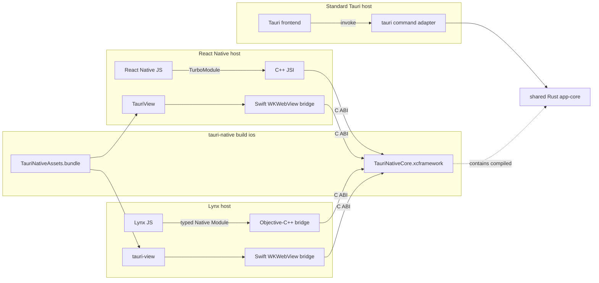

# tauri-native

Embed a packaged Tauri microfrontend in a React Native or Lynx application and call the same Rust command implementation from each host.

```tsx
import { TauriView, invoke } from '@tauri-native/react-native';

const response = invoke<Calculation>('calculate', {
  expression: '7 * (8 - 2)',
});

export function Screen() {
  return <TauriView style={{ height: 330 }} />;
}
```

> **Project status:** experimental iOS proof of concept. The packages are not published yet. The repository demonstrates the intended package and CLI contracts using workspace dependencies.

## Why tauri-native?

`tauri-native` is for teams that have ordinary, independently runnable projects:

- a React Native or Lynx application that owns the mobile lifecycle and native navigation;
- a Tauri application that owns a web frontend and reusable Rust behavior.

Adding `tauri-native` packages the Tauri frontend and Rust core for the mobile host without merging scaffolds or starting a second Tauri application runtime.

The examples preserve that boundary on purpose: `examples/react-native`, `examples/lynx`, and `examples/tauri` remain ordinary scaffolded applications. The mobile screens show a native direct-call area and a visibly separate `TauriView` surface; the same Tauri project also runs as the desktop application.

On desktop, that Tauri frontend fills the native window. On iOS, the same packaged frontend appears only inside the labeled `TauriView` boundary, so ownership remains visible in the demo rather than being hidden by matching chrome.

## Packages

| Package | Responsibility |
| --- | --- |
| `@tauri-native/react-native` | Fabric `TauriView`, synchronous JSI `invoke`, and iOS native integration |
| `@tauri-native/lynx` | Lynx custom `TauriView`, typed native-module `invoke`, and iOS native integration |
| `@tauri-native/cli` | Builds the Rust core as an XCFramework and packages the Tauri frontend as an iOS resource bundle |

`@tauri-native/react-native` uses React Native Builder Bob to produce ESM and TypeScript declarations. `@tauri-native/lynx` follows Lynx Native Library autolinking and code generation. `@tauri-native/cli` uses Commander for its command interface and `@clack/core` for terminal output.

## Architecture



There are five invocation paths:

1. React Native JS → generated TurboModule → C++ JSI → Rust C ABI.
2. Packaged Tauri frontend in React Native → Swift `WKWebView` bridge → Rust C ABI.
3. Lynx JS → generated native module → Objective-C++ bridge → Rust C ABI.
4. Packaged Tauri frontend in Lynx → Swift `WKWebView` bridge → Rust C ABI.
5. Standard Tauri frontend → `#[tauri::command]` → the same Rust crate.

The selected mobile host remains the sole owner of `UIApplication`, rendering, and lifecycle. `TauriView` is a Swift-owned `WKWebView`; it does not embed or initialize a second `tauri::App`.

## Run the example workspace

Install dependencies and generate the iOS artifacts:

```sh
nub install
nub run pods:ios
nub run pods:lynx:ios
```

Run the React Native example:

```sh
# Terminal 1
nub --cwd examples/react-native run start

# Terminal 2
nub --cwd examples/react-native run ios
```

Build and open the Lynx iOS example:

```sh
nub run pods:lynx:ios
open examples/lynx/ios/Hello-Lynx.xcworkspace
```

Run the same Tauri project as a normal desktop application:

```sh
nub --cwd examples/tauri run tauri dev
```

The example is a calculator rather than a hard-coded native response. JavaScript sends an editable expression to Rust. Rust parses decimals, unary signs, parentheses, and `+`, `-`, `*`, `/` with normal operator precedence.

The React Native screen exercises both mobile transports:

- `Run expression` calls Rust directly from React Native JavaScript through C++ JSI.
- The embedded `TauriView` runs the packaged Tauri frontend, whose existing `@tauri-apps/api/core.invoke('calculate', ...)` call reaches the same Rust implementation.

The Lynx example presents the same two operations using its generated `TauriNative` native module and registered `tauri-view` custom element.

The Lynx frontend follows the create-rspeedy scaffold. Its Swift host follows Lynx's [existing-app iOS integration flow](https://lynxjs.org/guide/start/integrate-with-existing-apps?platform=ios): initialize `LynxEnv`, provide the packaged bundle through `LynxTemplateProvider`, construct `LynxView`, and load `main.lynx`. [Native Library autolinking](https://lynxjs.org/guide/autolink) registers the tauri-native module and element. `XElement` is included because the calculator uses Lynx's native [`<input>`](https://lynxjs.org/next/api/elements/built-in/input.html).

## React Native API

### `TauriView`

```tsx
import { TauriView } from '@tauri-native/react-native';

<TauriView style={{ flex: 1 }} />;
```

`TauriView` accepts standard React Native `ViewProps`. In this PoC it loads the single `TauriNativeAssets.bundle` packaged by the CLI. Selecting bundles or remote URLs is intentionally unsupported.

The iOS views disable WebView pinch zoom, and the bundled demo locks viewport scaling so double-tap input focus cannot leave the embedded surface enlarged or horizontally clipped.

### `invoke<T>(command, payload)`

```ts
import {
  invoke,
  type InvokeResponse,
} from '@tauri-native/react-native';

interface Calculation {
  result: number;
  source: string;
}

const response: InvokeResponse<Calculation> = invoke('calculate', {
  expression: '(9 + 5) * 3',
});

if (response.ok) {
  console.log(response.value.result); // 42
} else {
  console.error(response.error.code, response.error.message);
}
```

The direct JSI API is synchronous. Keep commands short and CPU-bounded. File, network, database, or otherwise blocking commands require a future asynchronous API.

## Lynx API

```tsx
import { TauriView, invoke } from '@tauri-native/lynx';

const response = invoke<Calculation>('calculate', {
  expression: '(9 + 5) * 3',
});

export function Screen() {
  return <TauriView className="tauriView" />;
}
```

`invoke` uses the autolink-generated `TauriNative` native module. Native module callbacks must run in Lynx background scripting (`'background only'`). `TauriView` creates the registered native `tauri-view` element and loads the same packaged assets as the React Native component.

## CLI

```text
tauri-native build ios [options]

--tauri-dir <path>   Tauri Rust directory              default: src-tauri
--manifest <path>    Rust core Cargo.toml               default: <tauri-dir>/crates/app-core/Cargo.toml
--header <path>      C ABI header                       default: <manifest-dir>/include/tauri_native.h
--output-dir <path>  Generated iOS artifact directory   default: <tauri-dir>/gen/tauri-native/ios
```

Workspace example:

```sh
nub run build:native:ios
nub run build:native:lynx:ios
```

Equivalent direct invocation:

```sh
nub --cwd packages/cli run build
node packages/cli/dist/index.mjs build ios \
  --tauri-dir examples/tauri/src-tauri \
  --output-dir packages/react-native/ios/Generated
```

The command reads `build.beforeBuildCommand` and `build.frontendDist` from `tauri.conf.json`, builds the frontend, and produces:

| Artifact | Contents |
| --- | --- |
| `TauriNativeCore.xcframework` | arm64 iOS device plus arm64/x86_64 simulator static libraries and C header |
| `TauriNativeAssets.bundle` | The unchanged files from the configured Tauri `frontendDist` |

The Rust manifest must produce a `staticlib`. Its header must expose the current C ABI:

```c
char *tauri_native_invoke(const char *command, const char *payload_json);
void tauri_native_string_free(char *value);
```

The returned UTF-8 JSON allocation belongs to Rust and must be released exactly once with `tauri_native_string_free`.

## License

MIT OR Apache-2.0
